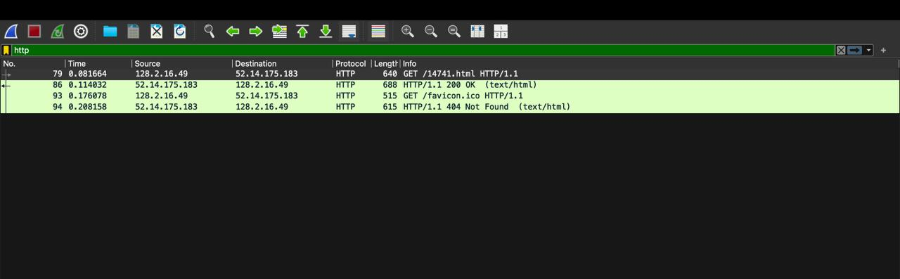
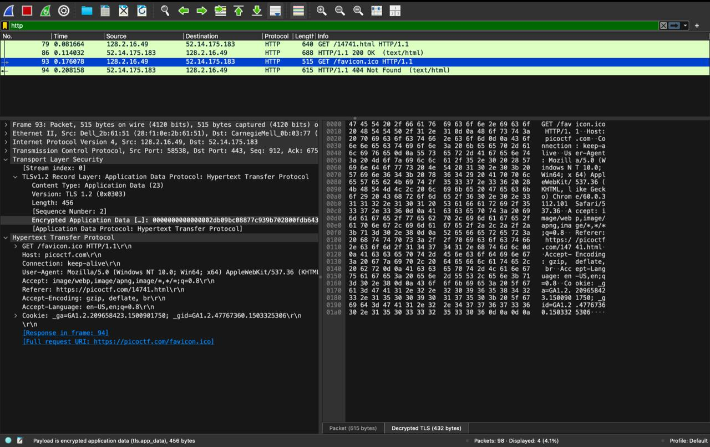
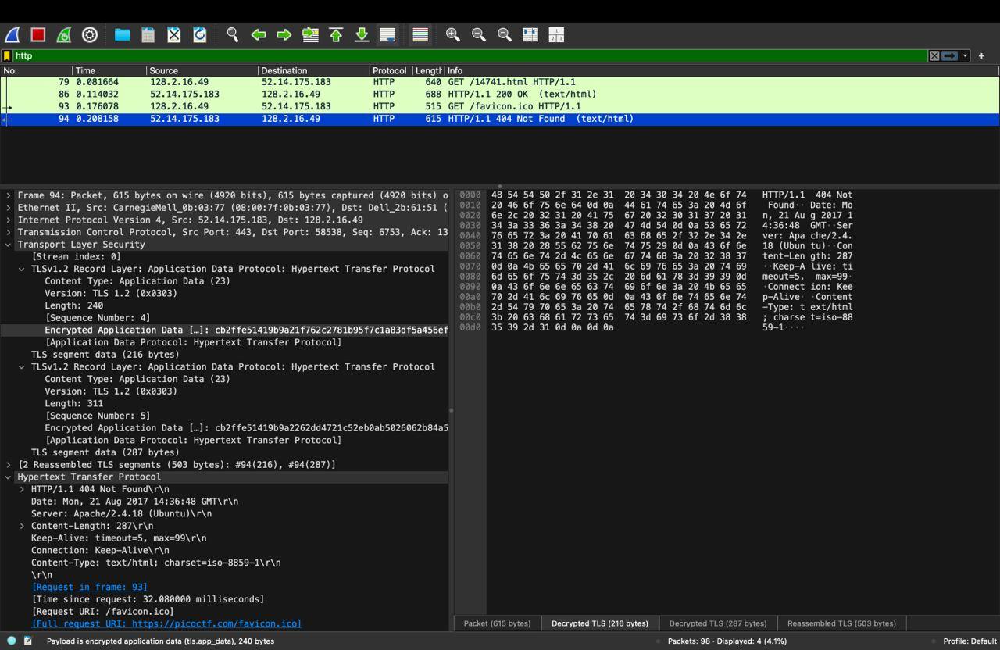
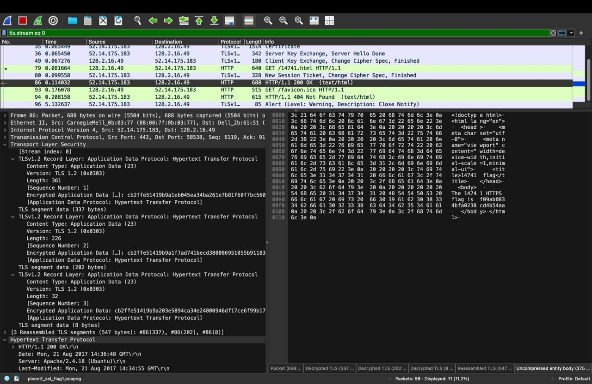
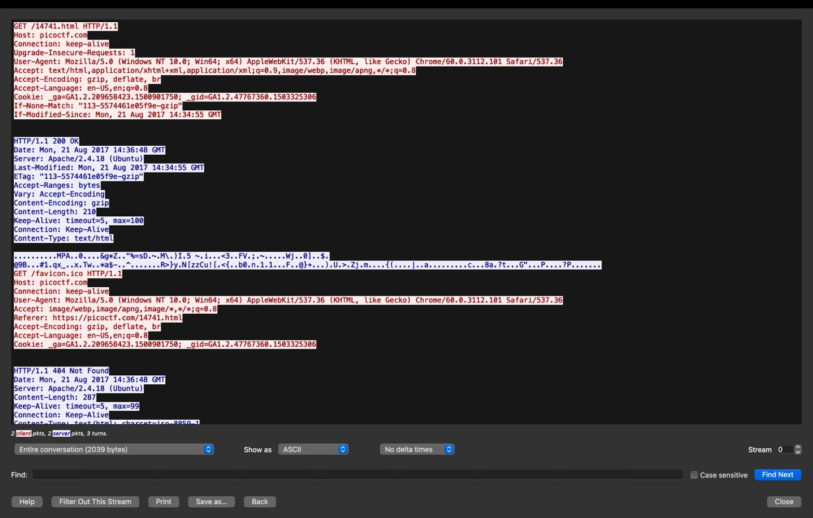

# Assignment 4: Decrypting HTTPS Traffic with Wireshark

## Q2.1: Decrypting `picoctf_ssl_flag1.pcapng`

### Step 1: Open the capture
I opened `picoctf_ssl_flag1.pcapng` in Wireshark. The traffic is between the client (128.2.16.49) and picoctf.com (52.14.175.183) over TLS 1.2 on port 443. Before decryption, the HTTP data appears only as encrypted "Application Data", so the `http` filter shows nothing useful.

### Step 2: Load the premaster secret
I went to **Edit → Preferences → Protocols → TLS** and set **(Pre)-Master-Secret log filename** to the provided `premaster.txt`. Wireshark uses these secrets to derive the session keys and decrypt the TLS records.

### Step 3: View the decrypted HTTP traffic
After loading the secrets, I applied the `http` filter. Four decrypted packets appeared:

| Frame | Direction | Info |
|---|---|---|
| 79 | Client → Server | GET /14741.html HTTP/1.1 |
| 86 | Server → Client | HTTP/1.1 200 OK (text/html) |
| 93 | Client → Server | GET /favicon.ico HTTP/1.1 |
| 94 | Server → Client | HTTP/1.1 404 Not Found |

The "Decrypted TLS" tab in the packet bytes pane shows the plaintext HTTP.





### Step 4: Follow the TLS stream
I used **Analyze → Follow → TLS Stream** to view the full conversation. The response body to `GET /14741.html` looks like garbage because it is gzip-compressed (`Content-Encoding: gzip`, 210 bytes).



### Step 5: Decompress the body and find the flag
I selected frame 86 (the 200 OK response) and clicked the **"Uncompressed entity body (275 bytes)"** tab at the bottom of the packet bytes pane. Wireshark decompressed the gzip body and showed the HTML, which contains the flag.



### Flag
```
f09ab0834bfa0238cd4b54aa
```

## Q2.2: Environment variable

The environment variable is **`SSLKEYLOGFILE`**. When it is set to a file path before Chrome starts, Chrome writes the TLS session secrets (premaster/master secrets) to that file in NSS key log format. Wireshark can then use that file to decrypt the captured TLS traffic.

Example: `export SSLKEYLOGFILE=$HOME/premaster_<rollno>.txt`

## Part 3: My own capture

Files submitted:
- `my_local_<rollno>.pcapng`
- `premaster_<rollno>.txt`

Steps I followed:
1. Set `SSLKEYLOGFILE` to `premaster_<rollno>.txt` and launched Chrome from the same terminal.
2. Started a Wireshark capture on my active network interface.
3. In an incognito window, with no accounts logged in, I visited a public website and sent a harmless query to an AI chatbot.
4. Stopped the capture and saved it as `my_local_<rollno>.pcapng`.
5. Loaded `premaster_<rollno>.txt` in **Edit → Preferences → Protocols → TLS** and confirmed the traffic decrypts.


No passwords, logins, tokens, or personal data were present in the capture.